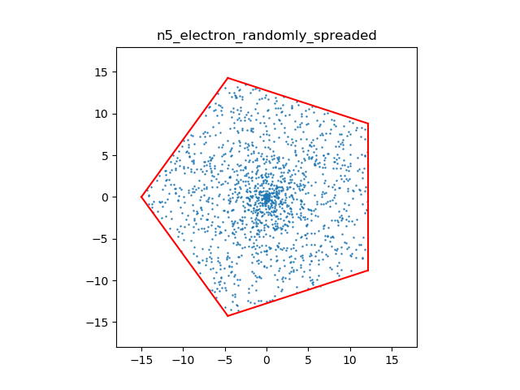
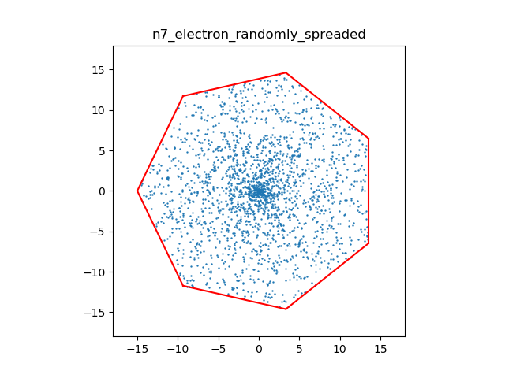
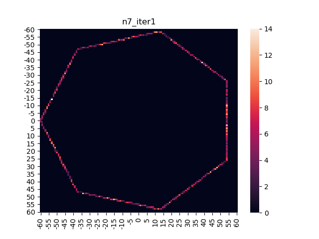
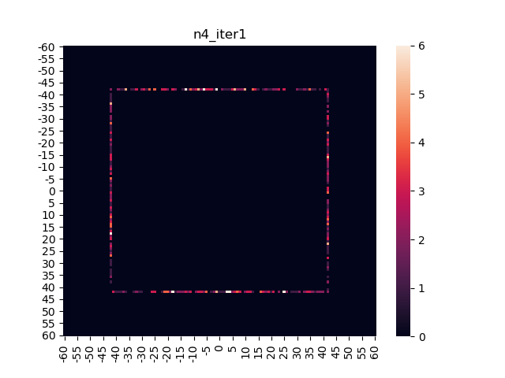
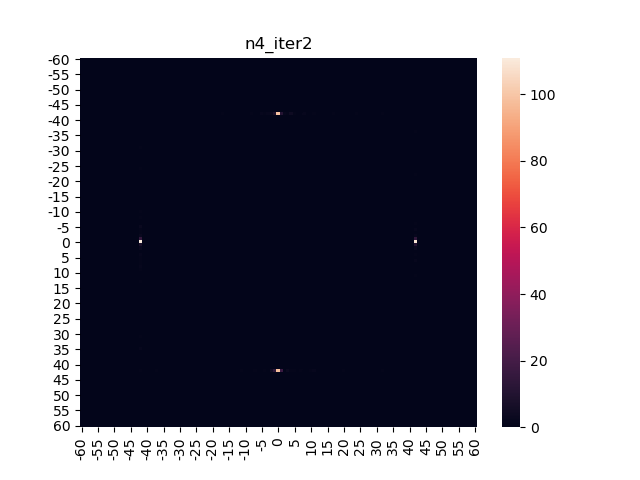
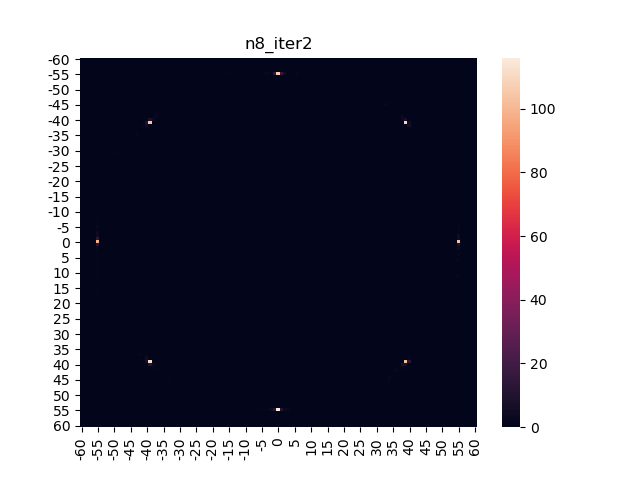
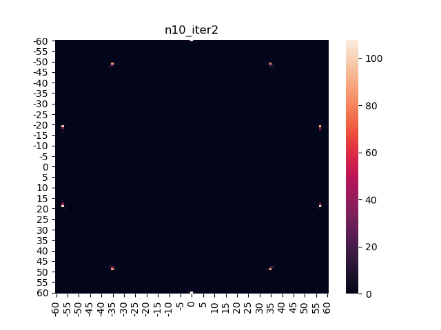

# ◉ Balance of Force in 2D Polygon Conductor

전자기학 수업 연계 프로젝트입니다.

### ✔ 탐구개요

도체는 자유전자끼리의 반발 때문에 표면에 전하가 분포하게 되며 각 전자는 전기력에 대하여 평형상태에 있다고 할 수 있다.  
본 탐구에서는 임의의 도체 평면판을 대전시킨 뒤 도체판의 모양에 따른 전하 분포 변화를 확인하는데 목적을 둔다.

### ✔ 정다각형에서의 분포

</img>
</img>

위쪽 그림과 같이 정다각형에 내에 전자를 무작위로 배치한 다음 전기력만을 고려하여 전하가 도체 표면에서 자유롭게 움직이도록 한다.  
1회 실시했을 때 다음과 같이 전하가 분포된다.

</img>
</img>

전자가 없는 곳은 검은색으로 표시되며 빨간색에서 흰색으로 갈수록 전하가 밀집되어 있을음 알 수 있다.

### ✔ 정다각형에서의 평형위치

실제로 얇은 도체판에서의 전하분포의 경우 대체로 도체판의 끝부분인 모서리에 전하가 많고 특히 꼭짓점에 좀 더 밀집된 양상을 보인다. 위의 두 사진은 1회 반복실시해서 그런지 꼭짓점에 많이 분포하지는 않아 반복횟수를 늘렸더니 다음과 같은 결과를 얻어낼 수 있었다.

</img>
</img>

위쪽 그림과 대조해보면 변의 삼등분점에 점으로 전하가 분포하고 있는 것을 알 수 있다. 이웃한 점을 두 개씩 묶어서 직선을 그은 뒤 만들어지는 도형을 생각하면 원래의 오각형과 칠각형이 만들어진다.

</img>
</img>
</img>
</img>

홀수각형에 대해서는 변의 삼등분점에 전하가 분포하였다.  
같은 과정을 짝수각형에 대해서 실시하였다.

</img>
</img>
</img>
</img>
</img>
</img>
</img>
</img>

이때 2*(2k-1)각형은 정다각형의 꼭짓점에, 2*(2k)각형은 정다각형의 변의 중점에 전하가 분포하는 것을 알 수 있다.

### ✔ 결과에 대한 고찰

홀수각형과 짝수각형 모두 전하가 분포한 위치는 전체적으로 보면 힘의 평형을 이루는 위치이다. 이때 다음과 같은 부분에 대해 의문점을 제기할 수 있다.

- 전하가 한 지점에 모이는 이유

  - 이론적으로 두 전자 사이의 저리가 매우 가까워지면 그 반발력이 매우 커져 밀려나야 하지만 컴퓨터의 한계로 거리가 특정 수 이하로 작아지면 "Devided by 0" 에러가 발생하게 되어 이 부분에 대한 예외처리가 들어갔다. 아무래도 거리가 매우 가까워진 경우의 반발력을 무시해서 이런 결과가 나온듯 싶다.  
    그러나 2회반복까지는 분모가 0이 되는 경우가 발생하지 않은 것으로 보아 다른 요인이 있을 수도 있다.

- 각 지점에 분포한 전하량의 차이(점의 진하기가 다름)

  - 그림을 자세히 보면 점의 진하기 즉, 밀짐된 전하의 수가 다른 것을 관찰할 수 있으며 대칭적이지도 않다. 2회반복이라 분배가 잘 이루어지지 않았을 수 있어 10회까지 반복한 결과 전하분포의 비대칭성이 증가함을 관찰할 수 있었다.

- 홀수각형과 짝수각형, 짝수각형에서도 그 종류에 따른 전하분포의 차이
  - 직관적인 관찰로 해답을 얻기 어려워 보여 추가 탐구가 필요해 보인다.

### ✔ 탐구의 확장 가능성

결과에 대한 고찰에서 제기한 문제들에 대한 탐구가 가능할 것이다.

- 거리가 0인 경우를 처리할 수 있는 방법을 고안하여 확인
- 각 지점에 분포하는 전하량의 차이 해석
- 정다각형의 종류에 따른 전하분포 차이에 대한 분석

또한 탐구의 큰 틀을 바꾸는 것도 가능하다.

- 정다각형 만이 아닌 다른 다각형에서의 전하분포 관찰
- 3차원 입체에서의 전하분포 관찰
- 힘의 평형위치에 대한 고찰
